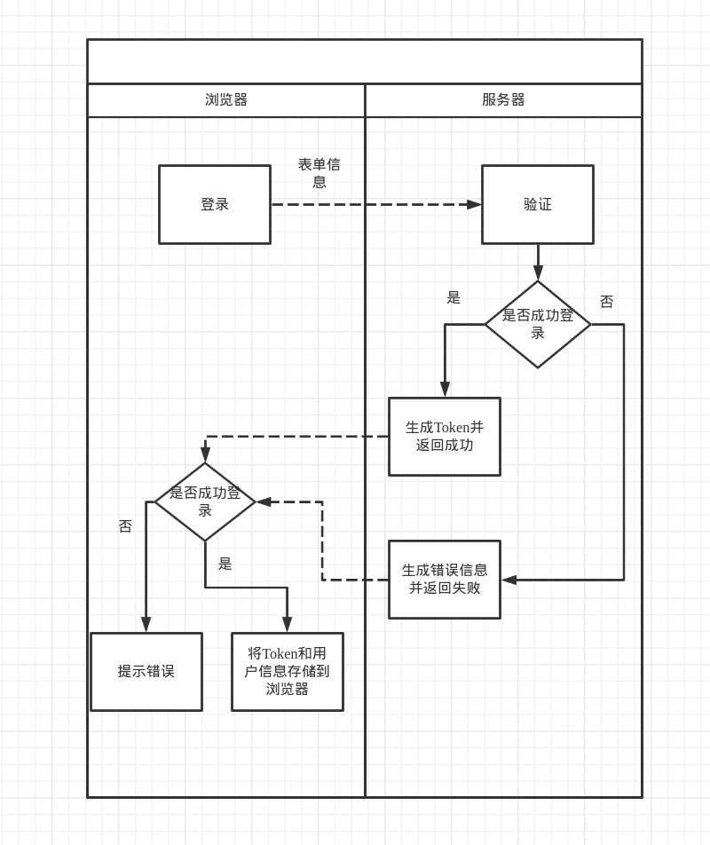
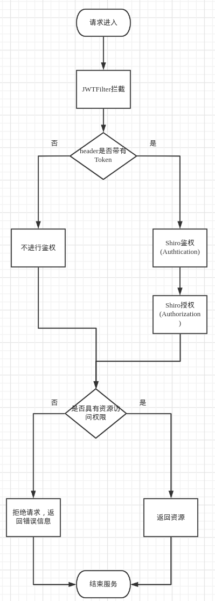

# vueBlog

​	一个支持浏览、发布、编辑、删除博客的网站，支持MarkDown格式发布、浏览。游客与用户可以**浏览**所有博客，但只有作者可以**编辑**、**删除**博客。

## 主要流程逻辑

​	后端的主要业务逻辑，主要在于对用户的请求进行

### 用户登录

### 用户访问

## 整合JWT

​	利用JWT传递用户非敏感信息，避免频繁查询数据库，减轻数据库的压力。

## 整合Redis

​	使用Redis作为缓存，避免鉴权、授权频繁查询数据库，减少数据库的查询次数。